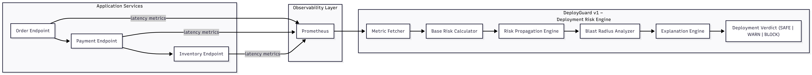

# DeployGuard — AI-Driven Deployment Impact & Risk Analysis Platform

## Problem Statement

Modern microservice systems are highly interconnected. A performance issue in one service can propagate across dependent services and cause cascading failures.

Common challenges:

- No real-time visibility into which service is risky
- Hard to estimate deployment blast radius
- Latency anomalies are detected late
- Root cause identification across service chains is slow
- Dependency knowledge is often manual and outdated

Result: Deployments become high-risk decisions instead of data-driven actions.

---

## Solution

DeployGuard is a deployment risk intelligence platform that:

1. Collects live service latency metrics from Prometheus.
2. Detects latency anomalies automatically.
3. Computes relative risk scores per service.
4. Builds a service dependency graph.
5. Propagates risk across upstream and downstream relationships.
6. Calculates blast radius of a deployment.
7. Stores and analyzes dependencies using a graph database.
8. Generates actionable impact reports.

This enables engineers to answer:

- Which service is currently risky?
- If Service X is deployed, what else can break?
- How far will the impact propagate?

---

## System Workflow

Spring Boot Services → Prometheus Metrics → Python Analytics Engine → Risk Scoring → Dependency Graph → Neo4j → Impact Report

---

## Pipeline Steps

1. Metrics Collection (fetch_metrics.py)
2. Latency Snapshot Storage (CSV)
3. Anomaly Detection (detect_latency_anomaly.py)
4. Risk Score Computation
5. Dependency Mapping (dependency_graph.py)
6. Risk Propagation (propagate_risk.py)
7. Impact Explanation (explain_risk.py)
8. Deployment Impact Report (impact_report.py)

---

## Key Features

- Real-time latency monitoring
- Automated anomaly detection
- Risk propagation across dependencies
- Blast radius estimation
- Graph-based dependency intelligence
- Automated impact reporting

---

## Tech Stack

### Backend and Services

- Java
- Spring Boot
- REST APIs

### Monitoring and Observability

- Prometheus
- Spring Actuator

### Analytics Layer

- Python
- Pandas
- NetworkX

### Graph Intelligence

- Neo4j Graph Database
- Cypher Query Language

### Development Tools

- Git
- VS Code

---

## Project Structure

deploy-impact-risk-platform/

- backend-java/
  - order-service
  - payment-service
  - inventory-service

- ai-ml-python/
  - src/
    - fetch_metrics.py
    - detect_latency_anomaly.py
    - dependency_graph.py
    - propagate_risk.py
    - explain_risk.py
    - impact_report.py
  - data/raw/

- neo4j/
  - service dependency graph

---

## How Risk is Calculated

1. Measure latency increase using Prometheus rate metrics.
2. Compute delta between historical and current values.
3. Normalize into relative risk score.
4. Propagate risk through the dependency graph.
5. Estimate total deployment impact.

---

## Example Impact Output

DEPLOY IMPACT REPORT

Service: order  
Risk Score: 0.136393  
Impacts: payment → inventory  

Total Deployment Blast Radius Risk: 0.272719

---
## 📐 Architecture (DeployGuard v1)

DeployGuard v1 is designed as an **out-of-band deployment risk analysis engine**.  
It does **not sit in the request path** of application services. Instead, it analyzes **observability data** to predict deployment impact **before release**.

The system consumes live latency metrics, computes service-level risk, propagates that risk across dependencies, and produces a deployment safety verdict.

---

### High-Level Architecture

---

### Architecture Overview

1. **Application Services**  
   - Order, Payment, and Inventory services form a dependency chain.  
   - Services expose latency metrics via Spring Actuator.

2. **Observability Layer**

## Future Enhancements

- Real-time dashboard UI
- ML-based predictive failure modeling
- CI/CD integration to block risky deployments
- Automated rollback suggestions
- Cloud reliability correlation

---

## Author

Sujal

Engineering Student focused on distributed systems, cloud reliability, and platform engineering.

GitHub: https://github.com/your-username  
LinkedIn: https://linkedin.com/in/your-profile

---

## Project Vision

DeployGuard is designed as a production-grade reliability intelligence platform that moves deployment decisions from intuition to measurable risk analysis.

Long-term objective:

- Enterprise-level deployment safety system
- AI-driven incident prevention engine
- Intelligent release-gating platform
