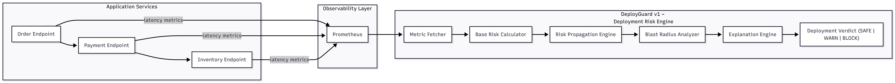
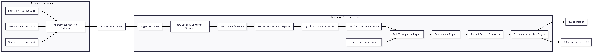

# DeployGuard — AI-Driven Deployment Impact & Risk Analysis Platform

## Problem Statement

Modern microservice systems are highly interconnected. A performance issue in one service can propagate across dependent services and cause cascading failures.

Common challenges:

- No real-time visibility into which service is risky
- Hard to estimate deployment blast radius
- Latency anomalies are detected late
- Root cause identification across service chains is slow
- Dependency knowledge is often manual and outdated

Result: Deployments become high-risk decisions instead of data-driven actions.

---

## Solution

DeployGuard is a deployment risk intelligence platform that:

1. Collects live service latency metrics from Prometheus.
2. Detects latency anomalies automatically.
3. Computes relative risk scores per service.
4. Builds a service dependency graph.
5. Propagates risk across upstream and downstream relationships.
6. Calculates blast radius of a deployment.
7. Stores and analyzes dependencies using a graph database.
8. Generates actionable impact reports.

This enables engineers to answer:

- Which service is currently risky?
- If Service X is deployed, what else can break?
- How far will the impact propagate?

---

## System Workflow

Spring Boot Services → Prometheus Metrics → Python Analytics Engine → Risk Scoring → Dependency Graph → Neo4j → Impact Report

---

## Pipeline Steps

1. Metrics Collection (fetch_metrics.py)
2. Latency Snapshot Storage (CSV)
3. Anomaly Detection (detect_latency_anomaly.py)
4. Risk Score Computation
5. Dependency Mapping (dependency_graph.py)
6. Risk Propagation (propagate_risk.py)
7. Impact Explanation (explain_risk.py)
8. Deployment Impact Report (impact_report.py)

---

## Key Features

- Real-time latency monitoring
- Automated anomaly detection
- Risk propagation across dependencies
- Blast radius estimation
- Graph-based dependency intelligence
- Automated impact reporting

---

## Tech Stack

### Backend and Services

- Java
- Spring Boot
- REST APIs

### Monitoring and Observability

- Prometheus
- Spring Actuator

### Analytics Layer

- Python
- Pandas
- NetworkX

### Graph Intelligence

- Neo4j Graph Database
- Cypher Query Language

### Development Tools

- Git
- VS Code

---

## Project Structure

deploy-impact-risk-platform/

- backend-java/
  - order-service
  - payment-service
  - inventory-service

- ai-ml-python/
  - src/
    - fetch_metrics.py
    - detect_latency_anomaly.py
    - dependency_graph.py
    - propagate_risk.py
    - explain_risk.py
    - impact_report.py
  - data/raw/

- neo4j/
  - service dependency graph

---

## How Risk is Calculated

1. Measure latency increase using Prometheus rate metrics.
2. Compute delta between historical and current values.
3. Normalize into relative risk score.
4. Propagate risk through the dependency graph.
5. Estimate total deployment impact.

---

## Example Impact Output

DEPLOY IMPACT REPORT

Service: order  
Risk Score: 0.136393  
Impacts: payment → inventory  

Total Deployment Blast Radius Risk: 0.272719

---

## Architecture (DeployGuard v1)

DeployGuard v1 is designed as an out-of-band deployment risk analysis engine.  
It does not sit in the request path of application services. Instead, it analyzes observability data to predict deployment impact before release.

The system consumes live latency metrics, computes service-level risk, propagates that risk across dependencies, and produces a deployment safety verdict.

---

### High-Level Architecture

---

### Architecture Overview

1. Application Services  
   - Order, Payment, and Inventory services form a dependency chain.  
   - Services expose latency metrics via Spring Actuator.

2. Observability Layer  

---
## Architecture (DeployGuard v2)

DeployGuard v2 introduces a modular, graph-aware statistical risk engine that performs rolling anomaly detection, probabilistic risk scoring, and dependency-aware risk propagation before deployment.

Unlike v1, which focused primarily on telemetry ingestion and threshold-based monitoring, v2 adds structured statistical modeling and automated deployment verdict generation.

The system operates as an out-of-band risk analysis engine that evaluates deployment impact before release.

---

### High-Level Architecture

---

### Architecture Overview

#### 1. Application Services (Java Layer)

- Order, Payment, and Inventory microservices  
- Built using Spring Boot  
- Metrics exposed via Micrometer and Spring Actuator  
- `/actuator/prometheus` endpoint exports latency metrics  

---

#### 2. Observability Layer

- Prometheus scrapes latency metrics from services  
- PromQL computes request rate and latency statistics  
- Prometheus HTTP API queried by DeployGuard ingestion layer  

---

#### 3. Data Ingestion Layer

- `fetch_metrics.py`  
- Queries Prometheus API  
- Extracts service-level latency metrics  
- Enforces rectangular time-series structure  
- Stores raw snapshots in `data/raw/latency_snapshot.csv`  

---

#### 4. Feature Engineering Layer

- `feature_engineering.py`  
- Computes:
  - Latency delta  
  - Rolling mean (window = 3)  
  - Rolling standard deviation  
- Sorts and normalizes time-series data  
- Outputs processed snapshot to `data/processed/feature_snapshot.csv`  

---

#### 5. Hybrid Anomaly Detection Engine

- `detect_latency_anomaly.py`  
- Performs:
  - Z-score computation  
  - Delta-based fallback detection for sparse data  
  - Sigmoid-based probabilistic risk scoring  
- Outputs:
  - `z_score`  
  - `is_spike` flag  
  - `risk_score`  

This approach allows anomaly detection to function even with limited historical data.

---

#### 6. Service Risk Engine

- `compute_service_risk()`  
- Converts anomaly signals into service-level base risk  
- Produces normalized risk scores per service  

---

#### 7. Dependency Graph & Risk Propagation

- `dependency_graph.py` loads service topology from configuration  
- Graph implemented using NetworkX `DiGraph`  
- `propagate_risk.py` performs:
  - Upstream risk propagation  
  - Decay-based transmission  
  - Blast radius estimation  

Risk spreads across dependencies to model potential cascading impact.

---

#### 8. Decision & Reporting Layer

- `explain_risk.py` generates structured reasoning  
- `impact_report.py` produces deployment impact summary  
- Automated deployment verdict:
  - SAFE  
  - WARN  
  - BLOCK  

Supports:
- Human-readable CLI output  
- JSON output for CI/CD automation  

---

### What Changed from v1 to v2

| Capability | v1 | v2 |
|------------|----|----|
| Latency Monitoring | Static Snapshot | Rolling Statistical Modeling |
| Anomaly Detection | Threshold-Based | Hybrid Z-Score + Delta |
| Risk Modeling | Binary | Continuous Probabilistic |
| Propagation | Basic | Graph-Based Decay Propagation |
| Deployment Verdict | Manual Interpretation | Automated |
| Automation Support | CLI Only | CLI + JSON Mode |

---

DeployGuard v2 represents the transition from a monitoring prototype to a structured statistical deployment risk analysis system.

---

## Future Enhancements

- Real-time dashboard UI
- ML-based predictive failure modeling
- CI/CD integration to block risky deployments
- Automated rollback suggestions
- Cloud reliability correlation

---

## Author

**Sujal Patil**  

---

## Project Vision

DeployGuard is designed as a production-grade reliability intelligence platform that moves deployment decisions from intuition to measurable risk analysis.

Long-term objective:

- Enterprise-level deployment safety system
- AI-driven incident prevention engine
- Intelligent release-gating platform

## Project Status: Discontinued

This project is no longer actively maintained.

Reason:
The current implementation does not align with the intended long-term direction and would require a significant redesign rather than incremental improvements.

What this means:
- No further updates or features will be added
- Issues and pull requests may not be reviewed

Next Steps:
Active development has shifted to newer projects with a stronger focus on scalable backend systems and real-world applicability.

Please refer to the pinned repositories for ongoing work.
